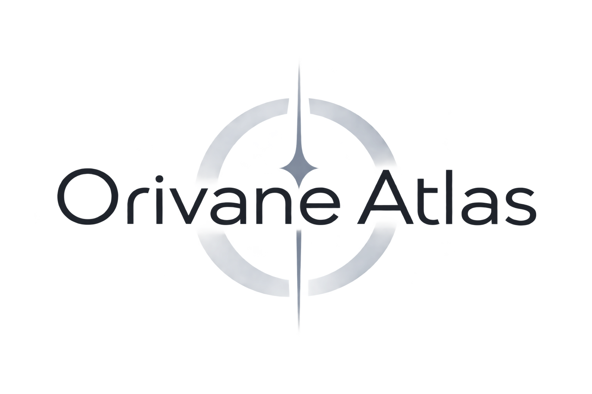

<p align="center">
  
</p>

<h1 align="center">Orivane Atlas</h1>

<p align="center">A knowledge-centric workspace with AI assistance, Markdown documents, projects, and server-backed persistence.</p>

<p align="center"><a href="https://github.com/LiangzhengZhou/OrivaneAtlas/releases">Releases</a> · <a href="docs/SELF_HOSTING.md">Self-hosting</a> · <a href="docs/DEVELOPMENT.md">Development</a> · <a href="LICENSE">Apache-2.0</a></p>

## What it is

Orivane Atlas 2.0.2 is a self-hostable, knowledge-centric workspace with optional AI assistance. Projects organize work and bind knowledge spaces; documents retain Markdown, revisions, aliases and Wiki relationships. Web and native clients connect to the same server; the server remains the source of truth while clients may keep local drafts.

AI integration is optional. Orivane Atlas is not a handoff-only project: this repository is for people who want to run, use, extend, or contribute to the product.

## Features

- Workspace Shell with light/dark themes, collapsible navigation and Command Palette
- Projects with Overview / Tasks / Knowledge and Owned / Linked / Inherited / Primary knowledge spaces
- Markdown document workspace with revisions, diff/merge, Slash commands and Undo
- Wiki links, persistent aliases, backlinks, unresolved-link resolution and same-space document hierarchy
- Separate project task dependency graphs and local / space / workspace knowledge graphs
- Atlas Assistant with permission-filtered retrieval, version-bound context approval, streaming and persistent sessions
- Shared AI capabilities, provider adapters and explicitly trusted local/private endpoints
- Notes, journals, tasks, calendar views, boards, import, export and recovery
- Account and workspace isolation
- SQLite-backed self-hosted deployment with an HTTP API
- SQLite/PostgreSQL knowledge application adapters with shared persistence-parity tests
- English and Simplified Chinese UI
- Windows and Android native clients
- Optional AI provider integration with explicit context and approval boundaries

See the [2.0 changelog](CHANGELOG.md), [1.x migration guide](docs/MIGRATION_2.0.md)
and [runtime audit](docs/UNIFIED_UPGRADE.md). The shipped account/HTTP Host uses
SQLite; PostgreSQL knowledge parity does not imply a PostgreSQL account server.

## Architecture overview

```text
Workspace
  → Projects
  → Knowledge Spaces (owned, linked, inherited; primary selection)
  → Documents (Markdown, revisions, aliases, hierarchy)
  → Wiki Graph
  → AI Context (permission-filtered and approved)
  → Assistant
```

This is the knowledge flow; task dependency graphs remain separate. Code follows
UI → Application → Domain / Ports → Adapters. Retrieval and capabilities call
application services, while the Model Gateway controls provider invocation,
approval, budgets and usage. See the [current architecture](docs/ARCHITECTURE.md).

## Quick start

See the [self-hosting guide](docs/SELF_HOSTING.md) for deployment instructions.

    pnpm install --frozen-lockfile
    pnpm build

For local development, read [docs/DEVELOPMENT.md](docs/DEVELOPMENT.md). The documentation index is [docs/README.md](docs/README.md).

## Downloads

Windows x64 and Android arm64 packages are published on [GitHub Releases](https://github.com/LiangzhengZhou/OrivaneAtlas/releases). Starting with 0.0.4, native clients include **Check for updates → Download and install**. Windows verifies signed update packages; Android uses a dedicated release key and asks the system installer for confirmation. Windows does not yet have a publicly trusted Authenticode publisher certificate and may display an unknown-publisher warning.

Version 2.0.2 includes newly built Windows x64 and Android arm64 release packages.
Cargo check and release-profile tests passed using the existing isolated Rust
toolchain; Windows updater signatures and the existing Android production
certificate were verified. Installed-app upgrade and Android physical-device
acceptance remain separate from these build and automated checks.

**Upgrading an old debug APK:** first synchronize and export local drafts, verify your backups, then migrate to the new release-key APK. Different signing keys prevent an in-place upgrade. Old clients without the updater need one manual installation. See [Native signing and updates](docs/NATIVE_UPDATES.md) for migration, verification, and current test limitations.

## Security and privacy

Never commit database files, authentication material, provider credentials, encryption keys, signing keys, or production configuration. See [SECURITY.md](SECURITY.md).

## License

Orivane Atlas is released under the [Apache License 2.0](LICENSE).
Dependency attribution and distribution boundaries are recorded in
[Third-party notices](THIRD_PARTY_NOTICES.md); dependency licenses remain their own.
